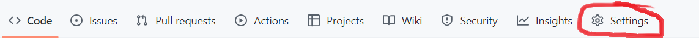

--- 
title: "An Example book down"
author: "C.Marsh"
date: "`r Sys.Date()`"
site: bookdown::bookdown_site
documentclass: book
bibliography: [book.bib, packages.bib]
url: craig44.github.io/bookdownexample/
# cover-image: path to the social sharing image like images/cover.jpg
description: |
  This is a minimal example of using the bookdown package to write a book.
  In addition to hosting on github pages.
  The HTML output format for this example is bookdown::gitbook,
  set in the _output.yml file.
link-citations: yes
github-repo: https://github.com/Craig44/BookDownExample
---

# About

This is a _sample_ book written in **Markdown**. The purpose was to learn how to host a bookdown on a github pages site for future projects of mine. Any repo can have a bookdown directory which can then be used by Github actions to host it on a gihub page. For example, the bookdown location that created this page is in the sub-directory called **Documentation** at <https://github.com/Craig44/BookDownExample>.

## Process to publish bookdown on GH page
Create a folder in your github repository that contains your bookdown. A good way to get started is to download the GitHub repository <https://github.com/rstudio/bookdown-demo> as a Zip file, then unzip it locally. This is contains a minimal bookdown example that should be able to be compiled instantly and is very helpful to get started.


Once you have a bookdown that compiles locally, commit and push the necessary bookdown files to the remote repository and create a github actions workflow. An example github workflow used to create this bookdown can be [found here](https://github.com/Craig44/BookDownExample/blob/main/.github/workflows/deploy_bookdown.yml). We will work through that later in this section but before we do that you will need to do setup a github.io for your username or organisation [see here](https://pages.github.com/) for more information. The next thing you will need to do is create an empty branch on your github repository to deploy the bookdown, often this branch is called `gh-pages`. I used the following git command line calls below. These were borrowed from [here](https://gist.github.com/ramnathv/2227408)

```{bash, eval=FALSE}
cd /path/to/repo-name
git symbolic-ref HEAD refs/heads/gh-pages
rm .git/index
git clean -fdx
echo "My GitHub Page" > index.html
git add .
git commit -a -m "First pages commit"
git push origin gh-pages
```
To test you have set up the github.io and gh-pages branch correctly, you should be able to visit `USERNAME.github.io/REPONAME` or if it is with an organization `ORGANISATION.github.io/REPONAME` and see a website that has `My GitHub Page` displayed from the above gh-page branch. A tip if you can't see the webpage, go to the settings tab in your repository and go to the pages tab. This will tell you where/if your webpage is being hosted. 

{width=50%}

Once you have a github.io and gh-pages branch the next thing is to set up a github actions workflow. I will work through the following calls and explain the key points. The first section renders the gitbook into html files and saves it as an artifact called `_book`.

```{js, eval=FALSE}
jobs:
  bookdown:
    name: Render-Book
    runs-on: macOS-latest
    steps:
      - uses: actions/checkout@v1
      - uses: r-lib/actions/setup-r@v1
      - uses: r-lib/actions/setup-pandoc@v1
      - name: Install rmarkdown
        run: Rscript -e 'install.packages(c("rmarkdown","bookdown"))'
      - name: Render Book
        run: Rscript -e 'bookdown::render_book(input = "Documentation")'
      - uses: actions/upload-artifact@v1
        with:
          name: _book
          path: Documentation/_book/
```
The key parameters in this are `bookdown::render_book(input = "Documentation")` where if your bookdown is in a subdirectory you need to provid that directory by the `input` parameter. In addition to the artifact path on the last line `path: Documentation/_book/`. See how they are both `Documentation`, that is because this is the directory of my bookdown but this could be any directory that you store your bookdown in.

The next section of the workflow takes the artifact called `_book` publishes it to the branch called `gh-pages` where it can be visualised at your github.io site.
```{js, eval=FALSE}
# gh-action from Cecilapp/GitHub-Pages-deploy
checkout-and-deploy:
 runs-on: ubuntu-latest
 needs: bookdown
 steps:
   - name: Checkout
     uses: actions/checkout@v2
   - name: Download artifact
     uses: actions/download-artifact@v1.0.0
     with:
       # Artifact name
       name: _book # optional
       # Destination path
       path: _book # optional
   - name: Deploy to GitHub Pages
     uses: Cecilapp/GitHub-Pages-deploy@v3
     env:
        GITHUB_TOKEN: ${{ secrets.GITHUB_TOKEN }} # https://github.com/settings/tokens
     with:
        email: Craig.Marsh@niwa.co.nz               # must be a verified email
        build_dir: _book/                     # "_site/" by default
        branch: gh-pages                    # hosted
```
the parameters and inputs for this github action may change over time, to see the latest options and version [see here](https://github.com/Cecilapp/GitHub-Pages-deploy). The key component of this process is making sure your repository allows read and write access for the workflow. To see and change these go to settings tab (see figure above) of your github repository followed by the Actions tab scroll down to the `Workflow permissions` section where you want to make sure it is set to read and write.

Once you push that workflow fingers crossed it will render and publish.


```{r include=FALSE}
# automatically create a bib database for R packages
knitr::write_bib(c(
  .packages(), 'bookdown', 'knitr', 'rmarkdown'
), 'packages.bib')
```
