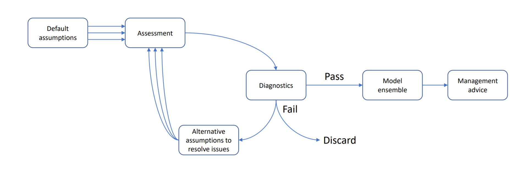

```{r, include = FALSE}
knitr::opts_chunk$set(
  collapse = TRUE,
  comment = "#>"
)
```

## Introduction
This vignette demonstrates how to use Casal2s simulation mode with `r4Casal2` R functions to generate posterior predictive checks for goodness of fit measures for model fits. In terms of assessment workflow, this falls in the Diagnostic component.


The following vignette uses the Casal2 model embedded into this R package. If you want to see where this is on you system paste the following line of code into your R console `system.file("extdata", "PosteriorPredictiveChecks", package = "r4Casal2")`



```{r setup, warning=FALSE, echo=T, results='hide'}
# install Casal2 R-library
# install_github(https://github.com/NIWAFisheriesModelling/CASAL2/tree/master/R-libraries/casal2, ref = "HEAD")
library(Casal2, warn.conflicts = F)
library(r4Casal2, warn.conflicts = F)
library(tidyverse)
library(ggplot2)
library(DHARMa)
```
 


## Estimation
Before looking at data goodness of fit you should be checking if the model has converged. We assume that the estimated model has satisfied this criteria i.e. invertable covariance, acceptable gradient (close to zero) and global minima (apposed to local try jittering start values).

```{r pressures, fig.width=6, fig.height=4}
mpd_file_name = system.file("extdata", "PosteriorPredictiveChecks","estimate.log", package = "r4Casal2", mustWork = TRUE)
mpd = extract.mpd(file = mpd_file_name)
# Report labels
names(mpd)
# is covariance symetric
isSymmetric(mpd$covar$covariance_matrix)
# is hessian invertable
is_matrix_invertable(mpd$hess$hessian_matrix)
```

## Simulations
The first thing you should do is add reports of type `simulated_observation` for each observation in your Casal2 configuration files. If you don't have these specified in your configuration files, Casal2 will not save simulated observations. Tips when specifying this report class

1. Save each simulated observation into a seperate `file_name`
2. Create a directory to save simulated data sets in.
3. Have the report label the same as the `file_name` (see example below)
4. Avoid haveing periods/dots (".") in `file_name`

An example report structure would look like
```{cmd report_example}
@report sim_chatTANage
type simulated_observation
observation chatTANage
file_name simulated_observations/sim_chatTANage
```

There are three variants of simulations you can conduct in Casal2, and these depend on if you are in MPD or MCMC estimation phase. If you are evaluating a MPD run, there are two variants and depend if you want to account for parameter uncertainty or not. If you don't want parameter uncertainty, then you need to run the following Casal2 command to produce 100 sets of simulations `casal2 -s 100 -i mpd_pars.log > simulate.log`. If you want to account for parameter uncertainty then you can use a multivariant normal distribution with mean equal to MPD and resulting covariance to produce a set of simulations, example below.
```{r sim_pars}
library(mvtnorm)
n_sims = 100
## NOTE: might have issue with bounds assuming normal dist
sims = rmvnorm(n = n_sims, mean = as.numeric(mpd$estimate_value$values), sigma = mpd$covar$covariance_matrix)
dim(sims)
colnames(sims) = names(mpd$estimate_value$values)
## save simulated pars in the same directory as your
## CSL files
if(FALSE)
  write.table(sims, file = "mpd_mvnorm_pars.csl2", quote = F, row.names = F, col.names = T)
# run 
# casal2 -s 1 -i mpd_mvnorm_pars.csl2 > simulate.log
```

## Summarising simulated data in R
Assuming you have saved all the simulated observations as seperate files in a standalone folder.


```{r read_simulations}
sim_dir = system.file("extdata", "PosteriorPredictiveChecks","simulated_observations", package = "r4Casal2", mustWork = TRUE)

sim_vals = read.simulated.data(dir = sim_dir)
# check no trouble with files
sim_vals$failed_files
# 
names(sim_vals$sim_obs)
```
## Posterior predictive checks
Once simulated data has been read into the R environment, we want to compare where the observed values fall relative to the posterior predictive distributions. We recommend using the DHarma r package for this.

```{r ppp, fig.width=8, fig.height=4}
## Create DHARMa objects and P-values
## for biomass
DHARMaResbio = createDHARMa(simulatedResponse = sim_vals$sim_obs$sim_chatTANbiomass, 
  observedResponse = mpd$chatTANbiomass$Values$observed, 
  fittedPredictedResponse = mpd$chatTANbiomass$Values$expected, integerResponse = F)
## Create DHARMa objects and P-values
## for AF 
mpd$chatTANage$Values$mean_age = mpd$chatTANage$Values$observed * mpd$chatTANage$Values$age

mean_obs_bin = as.numeric(tapply(mpd$chatTANage$Values$mean_age, mpd$chatTANage$Values$year, sum))

DHARMaResAF = createDHARMa(simulatedResponse = sim_vals$sim_obs$sim_chatTANage, observedResponse = as.numeric(mean_obs_bin), 
  fittedPredictedResponse = NULL, integerResponse = F)

plot(DHARMaResbio, quantreg = F)
plot(DHARMaResAF, quantreg = F)
```


```{r ggplots_ppp}
########################
## boxplot predictive distribution vs observation
sim_data = sim_vals$sim_obs$sim_chatTANbiomass
rownames(sim_data) = mpd$chatTANbiomass$Values$year

bioplt = plot_predictive_dist(sim_data = sim_data, 
    obs = data.frame(obs = mpd$chatTANbiomass$Values$observed, 
    year = mpd$chatTANbiomass$Values$year), lab = "chatTANbiomass", plot_type = "violin")


sim_data = sim_vals$sim_obs$sim_chatTANage
rownames(sim_data) = unique(mpd$chatTANage$Values$year)
pppAFplt = plot_predictive_dist(sim_data = sim_data, 
          obs = data.frame(obs = mean_obs_bin, year = unique(mpd$chatTANage$Values$year)),
          lab = "Mean Age chatTANage", plot_type = "violin")
```


